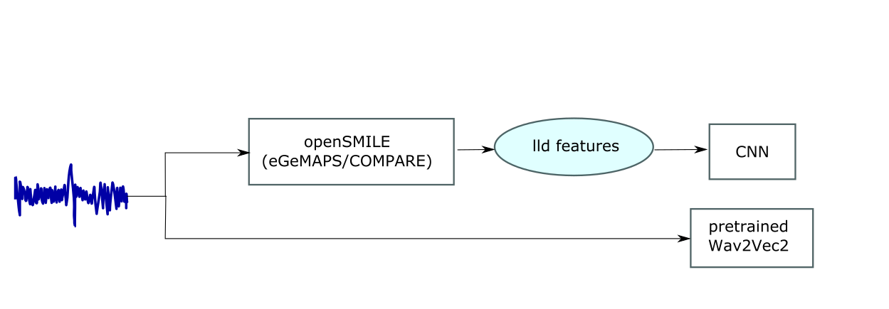

# Intoxicated Speech Detection
## Dataset
[Alcohol Language Corpus](https://www.en.phonetik.uni-muenchen.de/research/completed_projects/alc.html)
## Workflow

## Models
- CNN

- Pretrained Wav2Vec2
## Feature Extraction
- Feature sets: eGEMAPS, COMPARE
- Tool: [openSMILE](https://www.audeering.com/research/opensmile/)
## File structure
```bash
├── README.md
├── alc_cnn.ipynb
├── alc_wav2vec2.ipynb
├── cnn.png
├── feature_extraction_compare.py
├── feature_extraction_egemaps.py
├── file_name_split
│   ├── create_balanced_data.py
│   ├── file_name_split.py
├── load_convert_data.py
├── requirements.txt
└── workflow.png

```
## Data preprocessing
- Acoustic features of all wav files are extracted using openSMILE.
- Once openSMILE is installed, you can nagigate to the config files to remove/add features you want to extract.
- The config file for **eGEMAPS** feature set is, e.g., saved under: `anaconda3/envs/TL/lib/python3.10/site-packages/opensmile/core/config/egemaps`
## Notes
- Json files are converted to h5 files (`load_convert_data.py`) to be loaded faster in CNN.